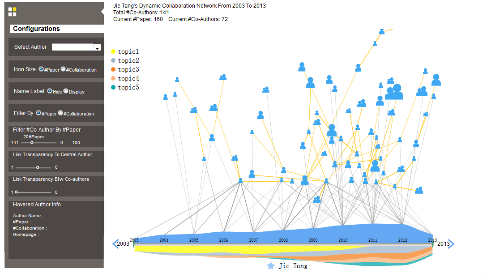

# 1.5D D3 Javascript Package

## D3 Network Vis Package Description

The package can be download here: <http://211.147.15.14/UCAS_14_Fall/data/DynamicNetwork.rar>

The online demo:<http://211.147.15.14/usr/liuqs/DynamicNetwork/app/dynamicnet.html>

## Usage

* Unzip into a folder
* Run on web server: copy the files into any web server and open <http://webserver_root/DynamicNetwork/app/dynamicnet.html> from browser
* Run from javascript IDE (e.g. WebStorm): 
    1. unzip DynamicNetwork.rar; 
    2. use IDE to open the source code. Click "File" -> Click "Open" -> Select the "DynamicNetwork" file; 
    3. run the demos dynamicnet.html from IDE. Click the browser icon on the upper right corner, e.g. firefox.
* Design your new network visualization demo: 
    1. create your own source code by simulating the files in "src"; 
    2. create your own css file, javascripte file and html file in "app"; 
    3. prepare your own network data and change the data file linkage in the javascripte file;

## Data Sample

* JSON data (.json). Sample social network: the sample data is in the data file

## Screenshot

