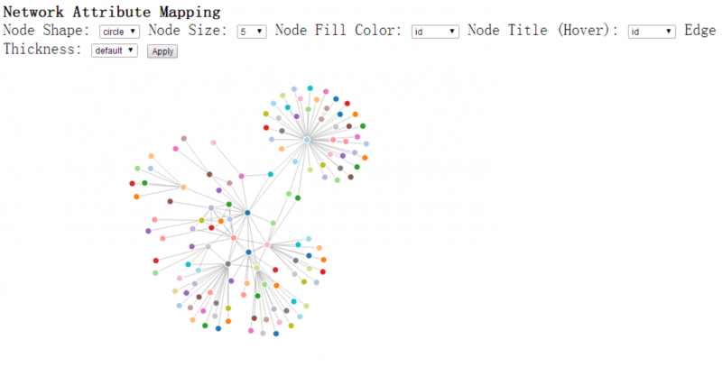

# D3 JavaScript Package

## D3 Network Vis Package Description

The package can be download here: <http://lcs.ios.ac.cn/~shil/data/incoming/D3_force_new_assignment_III.zip>

The online demo: <http://lcs.ios.ac.cn/~shil/test/D3/examples/force/force_new.html>

It includes:

* force_new.html: The wrapper html to embed D3 script.
* force_new.js: The D3 script to read network data and create visualization
* force_new.css: css on the network visualization
* d3.js: D3 library
* Data sample: /data/socialnet_count.json

## Usage

* Unzip into a folder
* Run on web server: copy the files into any web server and open <http://webserver_root/force_new.html> from browser
* Run from javascript IDE (e.g. WebStorm): 
	* unzip D3_force_new_assignmentIII.jar; 
	* use IDE to open the source code. Click "File" -> Click "Open" -> Select the "D3_force_new_assignmentIII" file; 
	* run the demos in force_new.html from IDE. Click the browser icon on the upper right corner, e.g. firefox.
* Design your new network visualization demo: 
	* create your own css file, javascript file and html file; 
	* prepare your own network data file and change the data file linkage in the javascripe file; 
	* design your own css and html style. Create new nodes, links, layout algorithm and/or interactions by simulating the original force_new.js. You can find lots of demos in <https://github.com/mbostock/d3/wiki/Gallery>, you can also check the API Reference from <https://github.com/mbostock/d3/wiki/API-Reference>.

## Data Sample

* JSON data (.json). Sample social network: <http://lcs.ios.ac.cn/~shil/data/incoming/data/socialnet_count.json>

## Screenshot

