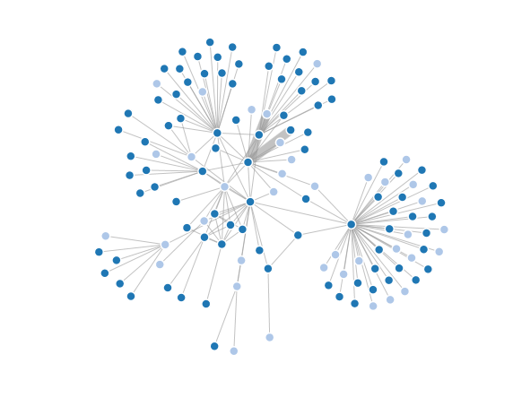

# D3 Javascript PackageII

## D3 Network Vis Package Description

The package can be download here: <http://211.147.15.14/UCAS_14_Fall/data/NetSeer-JS1.rar>

The online demo:<http://211.147.15.14/usr/shil/NetSeer-JS/netseer/app/netseervisdemo.html>

It includes:

* D3-3.4: D3.js usage examples.
* netseer: A sample packaged project baised on D3 library

## Usage

* Unzip into a folder
* Run on web server: copy the files into any web server and open <http://webserver_root/NetSeer-JS1/netseer/app/netseervisdemo.html> from browser
* Run from javascript IDE (e.g. WebStorm): 
    1. unzip NetSeer-JS1.rar; 
    2. use IDE to open the source code. Click "File" -> Click "Open" -> Select the "NetSeer-JS1" file; 
    3. run the demos netseervisdemo.html from IDE. Click the browser icon on the upper right corner, e.g. firefox.
* Design your new network visualization demo: 
    1. create your own source code by simulating the files in "src"; 
    2. create your own css file, javascripte file and html file in "app"; 
    3. prepare your own network data and change the data file linkage in the javascripte file; 
    4. smash together a minimal JavaScript library as the "netseer.js" and "netseer.min.js" bundle with only the parts you need, you can consult the details in <https://github.com/mbostock/smash/wiki>

## Data Sample

* JSON data (.json). Sample social network: the sample data is in the data file

## Screenshot

